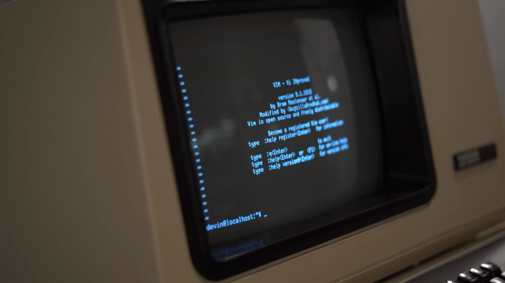

# CSI, OSC, DCS: 50 years of wire format

<!-- column_layout: [2, 3] -->

<!-- column: 0 -->



_DEC VT100, 1978._

_The wire format every modern terminal still implements._

_photo: <https://nikhiljha.com/posts/vt100/>_

<!-- column: 1 -->

## CSI (`ESC [`): control

```
\x1b[31m         SGR       set fg red
\x1b[2J          ED        erase display
\x1b[10;5H       CUP       cursor to (10, 5)
\x1b[?1049h      DECSET    enter alt screen
\x1b[?25l        DECTCEM   hide cursor
```

## OSC (`ESC ]`): system

```
\x1b]0;title\x07          OSC 0   window title
\x1b]52;c;<b64>\x07       OSC 52  clipboard
\x1b]8;;url\x07x\x1b]8;;\x07
                          OSC 8   hyperlink
```

## DCS (`ESC P`) / APC (`ESC _`): payloads

```
\x1bPq...\x1b\\           DCS     sixel image
\x1b_Gf=100,a=T;<b64>\x1b\\
                          APC     kitty graphics
```

<!-- reset_layout -->

## libghostty-vt: bytes to grid

```rust
let mut vt = VtTerminal::new(TerminalOptions {
    cols, rows, max_scrollback: 10_000,
})?;

vt.vt_write(b"\x1b[31mhello\x1b[0m world");   // bytes in

let snap = render_state.update(&vt)?;         // grid out
for row in snap.rows() {
    for cell in row.cells() {
        // cell.character, cell.fg, cell.bg
    }
}
```

<!-- end_slide -->

# The renderer: shape, raster, atlas, GPU

```
   shell           kernel               séance
   ┌─────┐  bytes  ┌─────┐   bytes   ┌─────────────┐   pixels   ┌────┐
   │ zsh │ ──────▶ │ PTY │ ────────▶ │ libghostty  │ ─────────▶ │wgpu│
   │     │ ◀────── │     │ ◀──────── │   vt parser │ ◀────────  │    │
   └─────┘  keys   └─────┘  keys     └─────────────┘  redraw    └────┘
                                            ▼
                                     grid + scrollback
```

<!-- column_layout: [1, 1] -->

<!-- column: 0 -->

## Shape (`cosmic-text` + `rustybuzz`)

Text run becomes glyph IDs with positions. Handles ligatures, ZWJ, flags,
combining marks.

```rust
buf.set_text(
    &mut fs, text, &attrs,
    Shaping::Advanced, None,
);
buf.shape_until_scroll(&mut fs, false);
// → glyph_id, x_advance per run
```

## Rasterize (`swash`)

Glyph ID becomes a pixel bitmap (mono or COLR / SVG colour).

```rust
let img = swash.get_image(&mut fs, key);
// → img.data, img.placement
```

<!-- column: 1 -->

## Atlas (`etagere`)

Bitmaps packed into one big GPU texture. Each glyph gets a sub-rect.

```rust
let slot = atlas.allocate(
    Size::new(w, h),
)?;
copy_bitmap(&mut tex, slot, &bitmap);
// → slot.rectangle in atlas
```

## Upload + draw (`wgpu`)

Dirty rects pushed to the GPU. Fragment shader samples the atlas per cell.

```rust
queue.write_texture(
    view, &bytes, layout, extent,
);
// frag: textureSample(atlas, uv)
```

<!-- reset_layout -->

## Shaping output

```
ligatures   ==   =>   !=   >=   <=   ->   |>
boxes       ─ │ ┌ ┐ └ ┘ ├ ┤ ┬ ┴ ┼ ╭ ╮ ╰ ╯ ╳
icons       ⌘   ✨   ⚙   ◆   ●   ▲   ★
```
